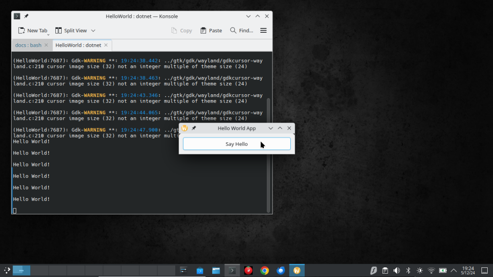
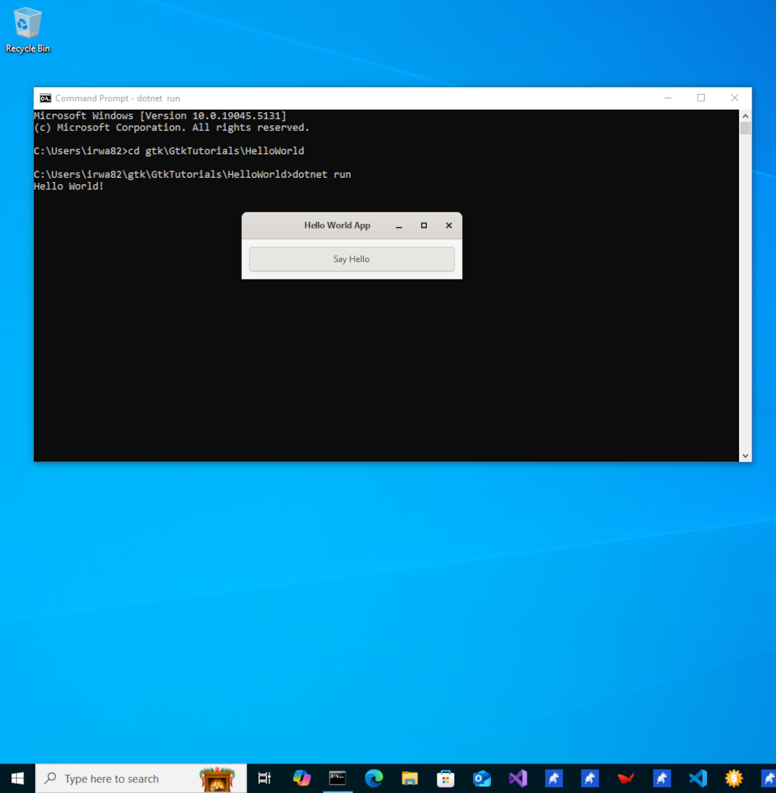
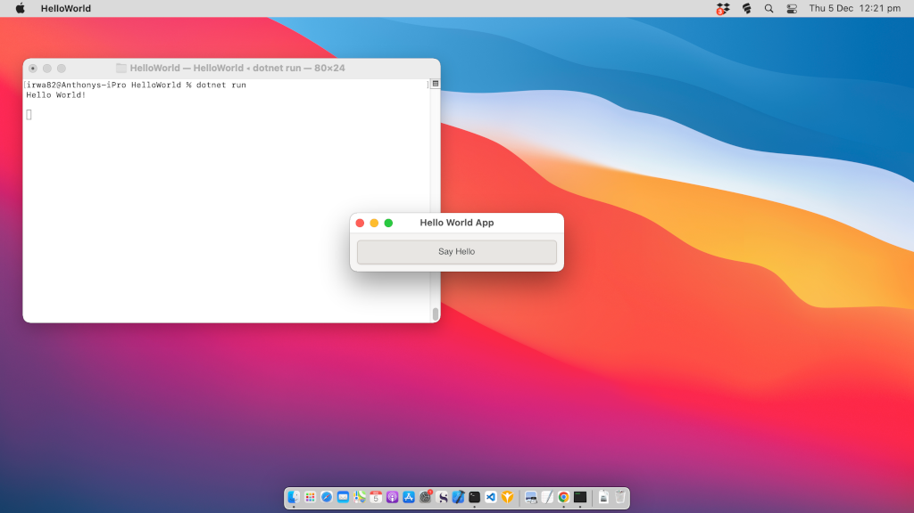

# Hello World Gtk Tutorial

In this hello world tutorial you will learn how to build a basic C# Gtk Application with a single Gtk Button widget inside it.

We will begin by creating a `GtkTutorials` directory to contain the Gtk tutorials you do and create the HelloWorld project using the command line. 

```
mkdir GtkTutorials
cd GtkTutorials
dotnet new console -f net8.0 -o HelloWorld
dotnet new gitignore
dotnet new sln
dotnet sln add HelloWorld/
```

The above commands will create a new console project, a gitignore file and a solution file for the project with the HelloWorld project added to the solution file so that people using ide's can open the project easily. As you follow more Gtk tutorials you can create the projects in the `GtkTutorials` directory by using `dotnet new console -f net8.0 -o NewProject` and add the projects to the solution file by using `dotnet sln add NewProject` to have multiple projects in the same solution file.

Next we will download the GirCore.Gtk-4.0 nuget package into the project.

> [!TIP]
> You can check for newer versions by visiting the nuget website at [https://www.nuget.org/packages/GirCore.Gtk-4.0/#versions-body-tab](https://www.nuget.org/packages/GirCore.Gtk-4.0/#versions-body-tab).

```
cd HelloWorld
dotnet add package GirCore.Gtk-4.0 --version 0.5.0
```

The above commands will change to the HelloWorld directory then add the `GirCore.Gtk-4.0` package to the `HelloWorld.csproj` file.

We will now create a new class file to use to make the HelloWorld window in Gtk. This will later be loaded from the `Program.cs` file.

```
dotnet new class -n HelloWorld
```

Next open the `HelloWorld` directory in your favourite code editor or ide so we can edit the `HelloWorld.cs` and `Program.cs` files.

> [!NOTE]
> The code is commented to tell you what is happening. In addition to these comments the highlighted lines will be discussed further after the code block to give you more information.

**Filename: HelloWorld.cs**
[!code-csharp[](src/HelloWorld/HelloWorld.cs?highlight=37)]

**Line 37:**

On line 37 you set the `Child` of the `HelloWorld Gtk.Window` to be the `HelloWorld Gtk.Button`. 

It may be easier to understand visually by looking at the diagram below.

```mermaid
graph TB
    parent[HelloWorld Gtk.Window]
        subgraph parent [HelloWorld Gtk.Window]
            n1[helloButton Gtk.Button]
        end
```

As you can see the window is entirely made up of the `helloButton Gtk.Button` widget. In a real application you will use a `Layout Widget` like the `Gtk.Box` widget to have multiple widgets inside the window.

**Filename: Program.cs**
[!code-csharp[](src/HelloWorld/Program.cs)]

**Run the HelloWorld Application:**

Now we have completed the code for the hello world tutorial we can run the project.

```
dotnet run
```

If you have entered the code correctly and have the Gtk 4 runtime libraries installed correctly on your computer then you will see the Hello World application window appear on the screen.

> [!TIP]
> Try resizing the window to see that the `helloButton Gtk.Button` widget takes up the entire window with a 10 pixel margin around it.

# [Linux](#tab/linux)


# [Windows](#tab/windows)


# [MacOS](#tab/mac)

